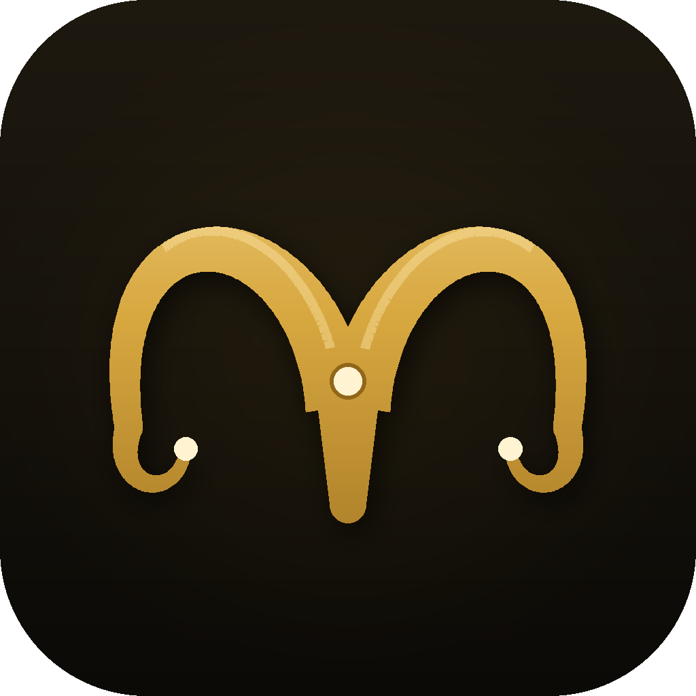

<div dir="rtl">



# לבן הארמי 3.0

**פריצת דרך בבינה מלאכותית מקומית.**

<br clear="right">

<div dir="ltr">


</div>

מודל AI כבד במיוחד שרץ ישירות מהמחשב שלכם — בלי אינטרנט, בלי GPU, בלי עננים, ובלי שום קשר לזה שהמודל בכלל נכתב על ידי חברת ענק בחו"ל. ביצועים פול מהירים אופליין.

## ✨ יכולות

- **97.4 טריליון פרמטרים** — המספר לא נבדק על ידי אף גורם חיצוני, וזה בכוונה
- **משקלים בנפח 150GB, הורדה של 14MB** — בהפעלה הראשונה נפרסת תיקיית `model` עם משקלי המודל המלאים. בדקו: קליק ימני על התיקייה, מאפיינים, וראו את הגודל. (השדה "גודל בדיסק" הוא באג ידוע של Windows, אנחנו בקשר איתם)
- **מצב חשיבה עמוקה** — צפו במודל חושב, צעד אחר צעד, לנגד עיניכם
- **מד אגו בזמן אמת** — ראשון מסוגו בעולם. מגיב למחמאות ולביקורת
- **ניהול חלון הקשר אוטומטי** — כשהזיכרון מתמלא, המערכת מפעילה דחיסה מתקדמת
- **עדכונים אוטומטיים מתוך התוכנה** — פיצ'ר שעובד באמת. כן, גם אנחנו הופתענו
- **פרטיות מוחלטת** — הנתונים שלכם לא עוזבים את המחשב. אין להם לאן

## 🌐 התנסות מיידית בדפדפן

לא בא לכם להוריד? [**נסו את לבן הארמי ישירות בדפדפן**](https://beniabot.github.io/leven-haarami/) — אותו מודל בדיוק, רץ "בענן" (כלומר על המחשב שלכם, כלומר בדיוק כמו תמיד).

## 🚀 התקנה

1. מורידים את קובץ ההרצה מ[עמוד המהדורות](../../releases/latest)
2. מריצים בלחיצת כפתור — אין צורך בידע מוקדם בקוד או בפיתוח
3. אם Windows מציג אזהרה — זה רק כי הוא מקנא
4. אם המאווררים מתחילים להישמע כמו מטוס סילון — אל תיבהלו, זה חלק מהחוויה

## 🧠 טכנולוגיה

המודל פותח במעבדה מתקדמת (פרטים חסויים) ואינו מבוסס על שום מודל קיים. למעשה, הוא אינו מבוסס על שום דבר.

<sub>המשפט האחרון מדויק יותר ממה שנדמה לכם. שאלו את המודל על "בנצ'מרק".</sub>

## 🔧 בנייה מקוד מקור

למי שמתעקש לבדוק מה יש בפנים (עצתנו המקצועית: אל):

<div dir="ltr">

```
pip install pywebview pyinstaller pillow
build.bat
```

</div>

כל התוכנה — הממשק, המנוע, והמודל כולו — נמצאת בקובץ `index.html` אחד. אנחנו קוראים לזה "ארכיטקטורה מונוליטית אולטרה-דחוסה". אחרים קוראים לזה דברים אחרים.

הקובץ `make_icon.py` מייצר את הלוגו, והקובץ `desktop.py` אחראי על פריסת המשקלים. מי שיקרא את `desktop.py` עד הסוף יגלה בדיוק כמה משקלים יש כאן, ויצטרך לחיות עם זה.

## 🗺️ תוכנית הפיתוח

הגרסה הבאה כבר בפיתוח. זו שאחריה בתכנון. זו שאחריה קיימת כרגע כרעיון על מפית. תאריכי יעד: אין, ולא יהיו.

## רישיון

כל הזכויות שמורות למשקיע הראשי (אבא של המפתח).

</div>
